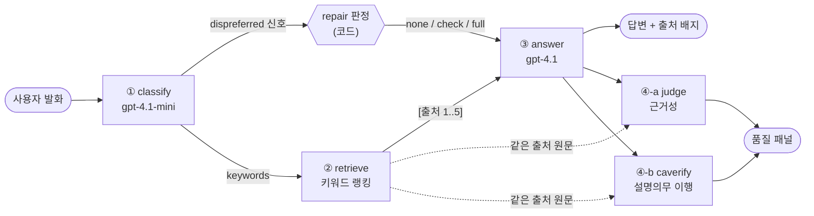

# 소보루

**근거를 보여주고, 못 알아들으면 다시 설명하는 금융 소비자 보호 에이전트** — 제8회 KB AI Challenge 출품작.

답변을 생성하는 데서 끝내지 않는다. 생성 모델과 **다른 판정기**가 같은 출처 원문을 보고 답변을 다시 채점하고, 그 채점 결과가 화면에 그대로 뜬다.

```
질문 → 답변 → [설명의무 이행 검증: 등급 A · 출처 커버리지 1.0 · 이해확인 ✅]
```

---

## 문제

금융 상담에서 소비자가 손해를 보는 지점은 대개 "정보가 없어서"가 아니라 **설명이 통하지 않아서**다. 금융소비자보호법 제19조는 판매업자에게 ① 중요사항을 이해할 수 있게 설명하고 ② **이해했는지 확인**할 것을 요구한다. 그런데 상담 봇은 보통 ①만 한다.

만들면서 잡은 문제는 셋이다.

| # | 문제 | 흔한 대응 | 이 프로젝트의 대응 |
|---|---|---|---|
| 1 | 그럴듯하지만 근거 없는 답변 | 생성 모델에게 "출처를 붙여라"라고 시킴 | **다른 판정기**가 출처 원문과 대조해 재판정 (§ 4단계) |
| 2 | 소비자가 못 알아들어도 대화가 그냥 흘러감 | "이해 안 되면 말씀해 주세요" | 반응의 **신호 강도별 2단계 개입** (§ repair) |
| 3 | 잘 됐는지 잴 기준이 없음 | 사람이 눈으로 봄 | 코드가 결정론적으로 채점하는 루브릭 + 변별력 테스트 |

특히 2번: 기존 시스템은 "이해가 안 돼요" 같은 **명시 신호는 잡고, 머뭇거림 같은 암묵 신호는 놓친다**. 그런데 소비자는 대개 암묵적으로 신호를 보낸다.

---

## 설계



### 왜 이렇게 나눴나

**① classify를 따로 둔 이유.** 검색 키워드 추출과 "직전 답변에 대한 반응인가" 판정은 같은 입력을 보고 하는 일이라 한 번의 호출로 묶었다. 반응 판정을 생성 모델에 맡기면 자기가 쓴 답변을 자기가 평가하게 된다.

**② 검색을 임베딩이 아니라 키워드로 한 이유.** 코퍼스가 45건이다. 이 규모에서 pgvector를 얹으면 임베딩 모델 선택·차원·재적재라는 운영 비용이 생기는데 재현율 이득이 거의 없다. 대신 검색이 헛도는 실제 원인을 고쳤다 — classify는 `"병력 미고지"` 같은 **구(句)** 를 내놓는데 구 전체를 substring 매칭하면 문서에 그대로 등장할 일이 없다. 그래서 토큰으로 쪼개고, 1글자 토큰은 버리고(아무 문서에나 걸린다), 제목 일치에 가중치 2를 준다(제목은 그 문서의 주제어라 본문 우연 일치보다 신호가 강하다). 한 토큰도 안 걸린 문서는 자리를 채우려고 끼워 넣지 않는다 — 무관한 출처를 인용하는 답변이 나오기 때문이다. 스키마(`supabase/schema.sql`)에는 `embedding vector` 컬럼을 미리 뚫어 두어 나중에 바꿔 끼울 수 있게 했다.

**③ 생성과 ④ 판정에 다른 모델 티어를 쓴 이유.** 생성은 `gpt-4.1`, 분류·판정은 `gpt-4.1-mini`. 판정은 구조화 출력(JSON schema, strict)으로 받는 정형 작업이라 상위 모델이 필요 없고, 한 턴에 판정이 두 번(judge·caverify) 도는 구조라 여기서 비용이 가장 많이 샌다. 교체 지점은 `server/lib/llm.ts`의 상수 두 줄이다.

**④ 판정을 두 개로 쪼갠 이유.** 서로 다른 질문이라서다.
- `judge` — **근거성**: 이 문장에 실제로 출처가 있는가. "출처를 표기했다"와 "출처에 그 내용이 있다"는 다르다.
- `caverify` — **설명의무 이행**: 용어를 풀었는가(F1), 거절을 이유·대안 없이 통보했는가(F2), 이해를 확인했는가(F4), 비용·불이익을 고지했는가(F6).

두 판정 모두 ③이 본 **것과 같은 출처 원문**을 받아 맹검으로 돈다(`server/lib/prompt.ts`의 `formatSources`가 세 에이전트에 같은 번호를 공급한다). ③의 자기주장을 신뢰하지 않는 것이 이 구조의 핵심이다. 판정 실패는 답변을 막지 않는다 — `Promise.all` + `catch`로 병렬 실행하고, 실패하면 품질 패널만 비운다.

**등급은 모델이 아니라 코드가 계산한다.** LLM은 차원별 pass/fail과 원문 근거만 내놓고, 점수·적용 차원 수·등급은 `aggregateCA()`가 결정론적으로 집계한다. 같은 판정 원문이면 항상 같은 등급이 나와야 화면 배지와 등급이 어긋나지 않는다.

### 2단계 repair — 신호 강도에 개입 수위를 맞춘다

대화분석(CA)의 repair initiation은 단계적이라는 원칙을 제품화했다.

| ①의 신호 | 모드 | ③의 동작 |
|---|---|---|
| `hesitation`, `conditional_acceptance` (암묵) | `check` | 단정하지 않고 **걸린 지점 하나를 지목해 되묻는다**. 오판이어도 자연스러운 대화라 발동 비용이 낮다 |
| `lack_of_understanding`, `explicit_dissatisfaction` (명시) | `full` | 전면 재설명 (쉬운 언어 + 사례 + 짧은 문장) |
| `acceptance`, `none` | `none` | 발동 안 함 — ACCEPT는 시퀀스를 닫는 자리다 |

두 개의 판단이 여기 들어 있다.

- **감정 ≠ 문제.** `"ㅜㅜ 알겠습니다"`는 감정이 섞였을 뿐 수용이다. 여기에 재설명을 퍼부으면 대화가 더 나빠진다. 그래서 `acceptance`를 별도 신호로 두고 아무것도 발동시키지 않는다.
- **암묵 신호는 놓치느니 가볍게 확인한다.** `check`는 되묻기만 하므로 오판 비용이 낮다. 반대로 `full`은 기준을 높게 잡는다.

⚠️ 이해확인 턴(`check`)은 **설명을 제공하는 턴이 아니다.** 그래서 ④caverify에서 F1(용어 풀이)·F6(고지)이 구조적으로 미적용된다. 모드를 넘기지 않으면 판정기가 `"더 쉽게 설명해드릴까요?"`를 **맨살거절로 오독한다** — 실제로 겪은 오판이고, 그래서 `caverify(…, sources, repairMode)`로 턴 종류를 함께 넘긴다.

### 코퍼스를 이렇게 구성한 근거

`data/documents.jsonl` — 공개자료 기반 **45건**: 분쟁유형(`case`) 21 · FAQ 11 · 용어(`term`) 7 · 법령(`law`) 6.

- **분쟁유형이 가장 많은 이유**: 소비자가 실제로 묻는 것은 조문이 아니라 "내 상황이 이런데 이게 맞나요"다. 각 항목을 `전형적 상황 → [쟁점] → [판단 기준](근거 법령) → [소비자 행동]` 구조로 통일해, 검색된 문서가 그대로 답변의 뼈대가 되게 했다.
- **`case`는 특정 사건이 아니라 일반화된 분쟁 유형 설명이다.** 실제 분쟁조정 결정문을 인용하지 않으므로 당사자 식별 위험이 없다.
- **불확실한 조문 번호는 아예 쓰지 않았다.** 금소법 §17·19·20·21·46·47만 번호를 적고, 상법 고지의무·전자금융거래법·할부거래법·신용정보법은 법률명만 기재했다.
- **관행 수치는 단정하지 않는다.** 카드 부정사용 보상기간(60일), 중도상환수수료 면제(3년) 등은 상품·약관별로 달라서 답변에도 "상품·회사별 상이, 공식확인 권고"로 나가게 했다.

출처 목록·검증 체크리스트는 [`data/CORPUS_SOURCES.md`](data/CORPUS_SOURCES.md).

---

## 결과와 측정

### 저장된 실제 실행 결과 (재생 가능)

데모 시나리오 3종을 실제 파이프라인에 한 번씩 통과시켜 응답을 통째로 저장해 두었다. `scripts/make_demo.ts`가 생성하고, `?replay=<name>`으로 **API 키 없이** 그대로 재생된다.

| 시나리오 | `?replay=` | repair | 검색 출처 | judge 커버리지 | caverify 등급 |
|---|---|---|---|---|---|
| 보험 고지의무 위반 해지 (분쟁) | `insurance` | `none` | 5건 | 1.00 `grounded` | **A** (2/2) |
| 금리인하요구권 거절 (업무) | `loan` | `none` | 5건 | 1.00 `grounded` | **A** (3/3) |
| 암묵 신호 감지 → 이해확인 (복구) | `repair` | `check` | 5건 | 0.00 `grounded` ⚠️ | **A** (1/1) |

`npm run dev` 후 `http://localhost:5173/?replay=loan`.

⚠️ 세 번째 행은 **판정기가 자기 규칙을 어긴 기록**이다. judge의 시스템 프롬프트는 "사실 주장이 하나도 없는 턴(이해확인 질문만 있는 답변)은 `source_coverage=1`"이라고 지시하는데, 실제 출력은 `0`이면서 `verdict`만 `grounded`로 나왔다. 커버리지 지표가 이 턴 종류에서 신뢰할 수 없다는 뜻이고, caverify가 턴 종류를 받는 것처럼 judge에도 같은 처리가 필요하다는 신호다. 결과를 좋게 보이게 고르지 않고 그대로 둔다.

> 이건 벤치마크가 아니라 **n=3의 저장된 1회 실행**이다. 성능 주장이 아니라 "파이프라인이 끝까지 돌고 판정이 붙는다"는 증거로 읽어야 한다. 등급 A가 계속 나오는 것 자체가 지금 루브릭이 이 3건을 변별하지 못한다는 뜻이기도 하다 — 그래서 아래 변별력 테스트를 따로 만들었다.

### 네트워크 없이 도는 단위 테스트

```bash
npm test    # 52 tests, 0 fail, ~0.2s
```

LLM·Supabase를 타지 않는다. 검증하는 것:

- **repair 트리거** — 첫 턴 예외, 명시/암묵 신호 매핑, `acceptance` 무발동
- **검색 랭킹** — 토큰화 규칙, 제목 가중치, 상위 5건 절단, 0점 문서 제외, 실제 코퍼스 폴백 경로
- **판정 집계** — 등급 경계값, 차원별 미적용(na) 규칙, 이해확인 턴에서 F1·F6이 빠지는 규칙, *같은 판정 원문이면 같은 등급*이라는 불변식
- **프롬프트 조립** — 출처 번호 매김, 근거가 없을 때의 환각 방지 문구, 코퍼스 본문에 지시문처럼 생긴 문장이 있어도 `[출처 n]` 구획을 벗어나지 못하는지
- **비용 가드** — 시계를 주입해 시간·일 리셋, "거부된 요청은 하루 예산을 깎지 않는다"
- **코퍼스 무결성** — 스키마·id 중복·출처 URL, 위에 적은 45건 구성과의 일치, 개인식별 패턴(주민번호·전화·이메일) 부재

### 모델을 실제로 호출하는 평가 (유료)

`OPENAI_API_KEY`가 필요하고 호출당 비용이 든다.

```bash
npm run eval           # = eval:repair + eval:caverify
npm run eval:repair    # 일관성: repair 트리거 6개 경계 케이스. 하나라도 어긋나면 exit 1
npm run eval:caverify  # 변별력: 같은 질문 · 저품질 답변 A vs 개선 답변 B의 등급 비교
npm run eval:perturb   # 판별 타당성: 원본 gold vs 결함 주입본을 같은 코더로 채점
```

`eval:repair`가 잡는 것은 **판정의 일관성**이다. 경계 케이스가 여섯 개인데, 그중 `"ㅜㅜ 알겠습니다"`(감정 섞인 수용)와 `"아 네... 근데 그게 좀..."`(암묵 신호)의 구분이 이 시스템의 핵심 판단이라 여기가 흔들리면 제품이 무너진다.

`eval:perturb`(`scripts/ca_perturb.ts`)는 **루브릭 자체가 품질차를 잡는지**를 본다. 같은 상담을 원본과 결함 주입본(F1·F2·F4·F6 위반) 두 벌로 만들어 같은 코더로 채점하고, 변형본에서 실패가 늘어나는지 비교한다. 루브릭이 아무거나 통과시키면 여기서 두 줄이 같아진다.

> `eval:perturb`는 `data/ca/raw/`의 상담 코퍼스를 읽는다. **이 코퍼스는 재배포 대상이 아니라 저장소에 없다**(`.gitignore`). 원자료 없이는 이 스크립트만 돌지 않고, 나머지는 전부 돈다.

---

## 한계와 배운 것

**한계 (아는 것을 적는다)**

- **측정 규모가 작다.** 저장된 실행 결과는 3건, repair 경계 케이스는 6건이다. 통계적 주장을 할 수 있는 수준이 아니다.
- **judge는 턴 종류를 모른다.** caverify는 이해확인 턴에서 F1·F6을 미적용하는데, judge에는 같은 장치가 없어 사실 주장이 없는 턴에서 커버리지가 어긋난다(위 표의 ⚠️). 알고 있으나 아직 안 고친 결함이다.
- **판정기도 LLM이다.** `caverify`는 채점 자체를 `gpt-4.1-mini`가 한다. 집계·등급은 결정론적이지만 **입력이 되는 pass/fail은 결정론적이지 않다.** 사람 코더와의 일치도는 아직 측정하지 않았다.
- **프롬프트 주입은 구조 수준까지만 방어된다.** 검색 문서가 `[출처 n]` 구획 안에 갇히는 것은 테스트로 고정했지만, 모델이 그 안의 지시문 흉내를 실제로 무시하는지는 검증하지 않았다. 지금의 1차 방어선은 코퍼스가 큐레이션된 공개자료 45건이라 주입 표면 자체가 좁다는 것이다.
- **검색은 키워드 매칭이다.** 코퍼스가 커지면 동의어·표현 차이에서 재현율이 떨어진다. 스키마에 `embedding` 컬럼은 뚫려 있으나 적재·검색 함수는 비활성 상태다.
- **비용 가드는 인메모리다.** 인스턴스가 여러 개거나 재시작되면 카운터가 초기화된다. 단일 인스턴스 데모 전제.
- **`turns` 테이블에 대화·판정 로그를 쌓는 것은 아직 미구현이다.** 지금 측정이 3건에 머무는 직접적인 이유다.

**배운 것**

1. **"측정할 수 있게 만든다"는 것은 대개 코드 구조 문제였다.** 등급 계산이 LLM 응답 안에 있으면 테스트할 수가 없다. `aggregateCA`·`buildAnswerPrompt`·`createQuotaGuard`를 순수 함수로 꺼내는 것만으로 52건이 네트워크 없이 검증 가능해졌다.
2. **판정기에는 턴의 종류를 알려줘야 한다.** 이해확인 턴을 답변 턴 기준으로 채점하니 `"설명해드릴까요?"`가 맨살거절로 잡혔다. 루브릭이 틀린 게 아니라 **적용 범위(na 규칙)** 가 빠져 있었다.
3. **모델을 바꾸기 전에 프롬프트에 들어가는 것부터 보게 된다.** 검색이 헛돌던 원인은 검색 알고리즘이 아니라 classify가 내놓는 키워드의 모양(구 vs 토큰)이었다.

---

## 빠른 시작

```bash
npm install
cp .env.example .env      # OPENAI_API_KEY 입력 (없으면 MOCK 모드로 UI 확인 가능)
npm run dev               # web(5173) + api(8787) 동시 실행
```

- **MOCK 모드**: API 키 없이 UI·파이프라인 흐름 확인 가능
- **Supabase 없이도 동작**: `data/documents.jsonl` 로컬 검색으로 폴백
- **키 없이 실제 결과 보기**: `http://localhost:5173/?replay=loan`

### 명령

| 명령 | 하는 일 |
|---|---|
| `npm run dev` | 프론트(5173) + API(8787) 동시 실행 |
| `npm test` | 단위 테스트 52건 (네트워크 없음) |
| `npm run typecheck` | `src`·`server`·`scripts`·`tests` 전체 타입 검사 (strict) |
| `npm run lint` | oxlint |
| `npm run build` | 타입 검사 + `dist/` 생성 |
| `npm start` | 8787에서 API + 빌드된 프론트 동시 서빙 |
| `npm run eval` | 모델 호출 평가 (유료, 키 필요) |
| `npm run demo` | 데모 시나리오 3종 재생성 → `public/demo/*.json` (API 서버가 떠 있어야 함) |
| `npm run ingest` | `data/documents.jsonl` → Supabase `documents` 테이블 |

### Supabase (선택)

없으면 로컬 jsonl로 폴백하므로 건너뛰어도 된다.

1. Supabase 프로젝트 생성 → SQL Editor에서 `supabase/schema.sql` 실행
2. `.env`에 `SUPABASE_URL`, `SUPABASE_SERVICE_ROLE_KEY` 입력
3. `npm run ingest`로 적재

### 배포

Express 하나가 `/api/*`와 빌드된 프론트(`dist/`)를 함께 서빙하는 **단일 서비스** 구조라, Node를 돌릴 수 있는 곳이면 어디든 올라간다.

**Render** (`render.yaml` 블루프린트 포함): 저장소 연결 → `OPENAI_API_KEY`만 대시보드에 입력 → 배포. 빌드 `npm install && npm run build` / 시작 `npm start` / 헬스체크 `/api/health`.

⚠️ **공개 URL은 곧 비용**이다. 누구나 호출할 수 있고 호출마다 OpenAI 요금이 나가므로 비용 가드가 기본 적용된다.

| 환경변수 | 기본값 | 의미 |
|---|---|---|
| `RATE_LIMIT_PER_IP` | 20 | IP당 시간당 요청 수 |
| `RATE_LIMIT_DAILY` | 300 | 서비스 전체 하루 요청 수 |

초과 시 429와 함께 안내 문구가 화면에 표시된다(오류처럼 보이지 않게 처리됨). 남은 한도는 `/api/health`의 `daily_remaining`으로 확인한다. `OPENAI_API_KEY`를 넣지 않으면 MOCK 모드로 뜨므로, 비용 없이 UI만 공개하는 것도 가능하다.

---

## 프로젝트 구조

```
server/
  index.ts          Express — /api/chat 파이프라인, /api/health, dist/ 서빙
  agents/           classify · retrieve · answer · judge · caverify
  lib/
    llm.ts          OpenAI 클라이언트 + 모델 티어 상수(교체 지점)
    prompt.ts       formatSources — 생성·판정이 공유하는 [출처 n] 직렬화
    repair.ts       decideRepairMode — 2단계 repair 판정 (순수 함수)
    quota.ts        createQuotaGuard — 비용 가드 (시계 주입 가능)
    supabase.ts     환경변수 없으면 null → 로컬 폴백
    types.ts        서버·프론트 공유 타입 + ChatResponse 응답 계약
    mock.ts         키 없이 UI 개발용 목 응답
src/
  components/       Chat(출처 배지·repair 배지) · QualityPanel(판정 결과)
  lib/              api.ts · types.ts (server/lib/types.ts와 동일하게 유지)
  App.tsx           ?replay= 재생 모드
tests/              단위 테스트 6종 (네트워크 없음)
scripts/
  ingest.ts         jsonl → Supabase documents
  make_demo.ts      데모 시나리오 실행 결과 저장 → public/demo/
  test_repair.ts    repair 트리거 일관성 (유료)
  test_caverify.ts  판정기 변별력 A vs B (유료)
  test_pipeline.ts  전체 파이프라인 스모크 (유료)
  ca_code.ts        상담 코퍼스 F1~F6 코딩 → data/ca/ (유료, 원자료 필요)
  ca_perturb.ts     원본 vs 결함 주입본 판별 타당성 (유료, 원자료 필요)
data/
  documents.jsonl       공개자료 기반 45건
  CORPUS_SOURCES.md     출처·검증 체크리스트
supabase/schema.sql     documents · sessions · turns (Supabase SQL Editor에서 실행)
render.yaml             Render 블루프린트
```

설계 문서(`../docs/`)는 이 저장소에 포함되지 않는다.

## 환경 변수

`.env.example`을 복사해 쓴다. **키는 `.env`에만 두고 커밋하지 않는다**(`.gitignore` 등록됨).

| 변수 | 필수 | 없으면 |
|---|---|---|
| `OPENAI_API_KEY` | 아니오 | MOCK 모드로 동작 (UI·흐름 확인 가능, 실제 생성·판정은 안 됨) |
| `SUPABASE_URL` | 아니오 | `data/documents.jsonl` 로컬 검색으로 폴백 |
| `SUPABASE_SERVICE_ROLE_KEY` | 아니오 | 위와 같음 |
| `PORT` | 아니오 | 8787 (배포 시 호스트가 주입) |
| `RATE_LIMIT_PER_IP` | 아니오 | 20 |
| `RATE_LIMIT_DAILY` | 아니오 | 300 |

## 데이터 윤리

- 공개·비식별 자료만 사용한다. 수집 전 각 출처의 이용약관·공공누리 표시를 확인했고, 문서별 원문 링크를 `source_url`에 남긴다. (라이선스 표기용 `license` 컬럼은 스키마에 있으나 현재 코퍼스에는 채워져 있지 않다.)
- `case` 항목은 특정 사건이 아니라 일반화된 분쟁 유형 설명이다. 실명·개인정보를 포함한 사례는 쓰지 않으며, `npm test`가 주민번호·전화번호·이메일 패턴 부재를 매번 확인한다.
- 답변은 요약 자료에 근거한 안내이며 법적 효력은 원문 기준이다. 개별 사건의 결과를 예측하지 않는다.
